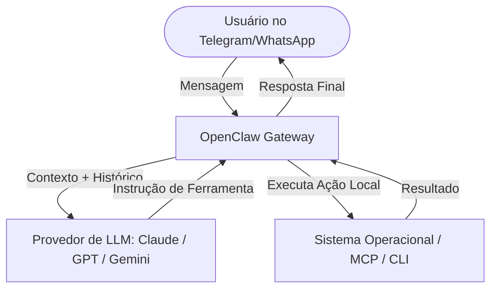

# Documentação Técnica do Ecossistema OpenClaw

O **OpenClaw** (originalmente concebido como *Warelay*, *Clawdbot* ou *Moltbot*) é um framework de agentes de IA local-first, de código aberto e focado em privacidade. Ele atua como um "exosqueleto" para Grandes Modelos de Linguagem (LLMs), permitindo que agentes inteligentes operem diretamente no hardware do usuário (macOS, Windows e Linux), usem ferramentas locais e se comuniquem por canais de mensageria diários como WhatsApp, Telegram, Discord e Slack.

---

## 1. Arquitetura e Funcionamento

O ecossistema OpenClaw é baseado em uma estrutura distribuída e orientada a eventos:



### Componentes Principais
1.  **O Gateway (Control Plane):** Um processo Node.js de longa duração que roda localmente e orquestra a sessão do agente, gerencia o histórico de chat e faz a ponte com provedores de LLM.
2.  **Canais (Channels):** Interfaces de entrada/saída que conectam o Gateway a aplicativos de chat externos.
3.  **Workspaces:** Diretórios específicos onde residem os arquivos de instrução do agente, histórico de sessões e arquivos de memória de longo prazo.
4.  **Habilidades (Skills):** Módulos extensíveis baseados em regras ou scripts que estendem as capacidades do agente.
5.  **Model Context Protocol (MCP):** Integração nativa com servidores MCP para automação de tarefas do sistema (ex: controle de tela, câmera e execução de comandos).

---

## 2. Estrutura Modular de Arquivos de um Agente

No OpenClaw, a identidade, a memória e o procedimento de execução de um agente são distribuídos em **arquivos Markdown estruturados**. Essa abordagem evita a sobrecarga de contexto e permite que o agente consulte dados sob demanda.

A estrutura padrão de diretórios de um agente OpenClaw no workspace é:

```text
meu_agente_openclaw/
├── SOUL.md         # Princípios éticos, personalidade e tom de voz (A Alma)
├── IDENTITY.md     # Metadados de hardware, canais ativos e escopo técnico
├── AGENTS.md       # Procedimento Operacional Padrão (SOP) de execução
├── TOOLS.md        # Catálogo de ferramentas ativas e checklist de controle de qualidade (QA)
├── MEMORY.md       # Histórico de Golden Standards e aprendizados contínuos
└── BOOTSTRAP.md    # Comandos de inicialização executados no boot do agente
```

### Detalhamento dos Arquivos

#### 2.1. `SOUL.md` (A Alma do Agente)
Este arquivo define o comportamento comportamental, ético e estilístico do agente. É lido no início de cada sessão e orienta o tom da resposta.
*   **Princípios Inegociáveis:** Regras de comportamento que o agente nunca deve violar (ex: *"Nunca inventar fatos ou chaves de API"*).
*   **Vibe e Tom de Voz:** O nível de formalidade e as regras linguísticas (ex: *"Direto, sem desculpas longas"*).
*   **Limites de Cortesia:** Impede que o agente gere mensagens introdutórias vazias, otimizando o consumo de tokens.

#### 2.2. `IDENTITY.md` (Ficha Técnica)
Contém as definições do ambiente de hardware e software que o agente controla, além dos seus metadados de identificação.
*   **ID do Sistema:** Identificador único (ex: `openclaw-agent-01`).
*   **Ambiente Operacional:** Informa ao LLM qual terminal ou shell está ativo (ex: Windows PowerShell).
*   **Canais Disponibilizados:** Canais de mensageria onde o agente está ativo.

#### 2.3. `AGENTS.md` (Procedimento Operacional Padrão - SOP)
Descreve o algoritmo mental passo a passo que o agente deve seguir a cada nova mensagem recebida.
*   **Checklist de Início:** A ordem exata em que o agente deve ler os arquivos do workspace (`SOUL.md` -> `TOOLS.md` -> `MEMORY.md`).
*   **Pipeline de Execução:** Passos estruturados (Intake -> Planejamento ReAct -> Execução -> Revisão QA -> Entrega).

#### 2.4. `TOOLS.md` (Habilidades e Checklist de Qualidade)
Mapeia as capacidades do sistema e o checklist de auto-revisão que o agente deve rodar antes de responder.
*   **Conector de Skills:** Lista e descreve como utilizar as habilidades nativas ou personalizadas (ex: `peekaboo` para arquivos, `web-search` para Tavily).
*   **QA Checklist:** Lista de verificação estrita para garantir código válido, sintaxe perfeita e ausência de placeholders.

#### 2.5. `MEMORY.md` (Memória e Golden Standards)
Guarda referências de alta fidelidade e lições aprendidas pelo agente ao longo do tempo.
*   **Golden Standards:** Exemplos perfeitos de solicitações e respostas ideais (Few-Shot Prompting).
*   **Aprendizados Acumulados:** Regras específicas do negócio inseridas dinamicamente pelo próprio agente ou pelo usuário.

#### 2.6. `BOOTSTRAP.md` (Boot do Sistema)
Contém os comandos ou scripts de shell que o gateway executará imediatamente ao ligar o agente, preparando o ambiente (ex: verificar atualizações, rodar scripts de migração).

---

## 3. Configuração do Gateway (`openclaw.json`)

A configuração global do OpenClaw é gerida através do arquivo `openclaw.json` na raiz do sistema. Abaixo está o esquema padrão detalhado:

```json
{
  "agents": {
    "defaults": {
      "workspace": "~/.openclaw/workspace",
      "model": {
        "primary": "anthropic/claude-3-5-sonnet",
        "fallbacks": ["openai/gpt-4o", "gemini/gemini-1.5-pro"]
      },
      "skills": ["gemini", "web-search"]
    }
  },
  "channels": {
    "whatsapp": {
      "enabled": false,
      "allowFrom": ["+5511999999999"],
      "groups": {
        "*": { "requireMention": true }
      }
    },
    "telegram": {
      "enabled": true,
      "token": "SEU_TELEGRAM_BOT_TOKEN_AQUI"
    },
    "discord": {
      "enabled": false,
      "token": "SEU_DISCORD_BOT_TOKEN_AQUI",
      "groupPolicy": "allowlist"
    }
  },
  "skills": {
    "allowBundled": ["gemini", "peekaboo"],
    "load": {
      "extraDirs": ["~/my-custom-skills"],
      "watch": true
    },
    "entries": {
      "web-search": {
        "enabled": true,
        "apiKey": { "source": "env", "provider": "default", "id": "TAVILY_API_KEY" }
      }
    }
  }
}
```

---

## 4. Comandos Principais da CLI do OpenClaw

O OpenClaw é operado a partir de um conjunto de comandos de terminal globais:

| Comando | Descrição |
| :--- | :--- |
| `openclaw onboard` | Inicializa o assistente interativo de configuração inicial (onboarding) |
| `openclaw doctor` | Analisa a saúde do ecossistema, valida conexões de API e executa migrações pendentes |
| `openclaw gateway start` | Inicia o processo do Gateway local em segundo plano |
| `openclaw gateway status` | Verifica se o gateway está ativo e exibe os logs de conexões de canais |
| `openclaw gateway stop` | Finaliza o processo do Gateway local |
| `openclaw message send --target <ID>` | Envia uma mensagem direta de teste ou administrativa para um canal ou destinatário |

---

## 5. Boas Práticas de Prompt Engineering para OpenClaw

1.  **Redução de Alucinação (Zero-Guess Policy):** Instrua sempre o agente no `SOUL.md` com a seguinte diretriz: *"Se você não tiver certeza ou se os dados necessários não forem fornecidos, relate explicitamente a lacuna. Nunca invente dados."*
2.  **Uso de Delimitadores Estruturados:** Use delimitadores claros como `###` ou tags XML (ex: `<payload>...</payload>`) para separar instruções de prompt das saídas de ferramentas.
3.  **Persistência de Memória:** Garanta que o agente saiba que tem permissão de escrita no arquivo `MEMORY.md` ao final de execuções bem-sucedidas para registrar padrões reutilizáveis.
